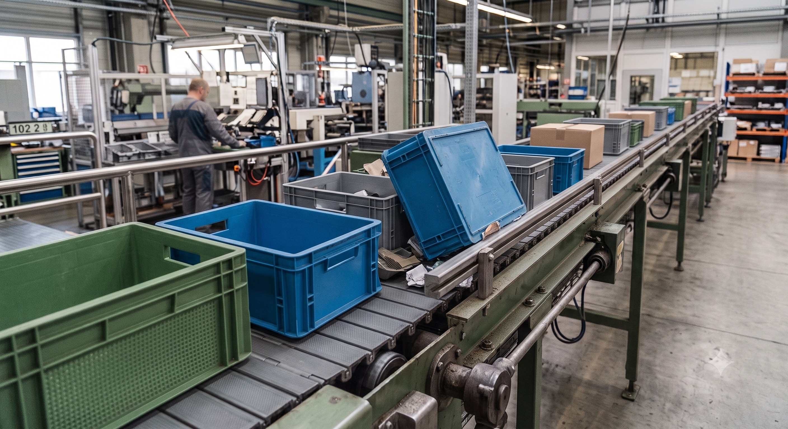
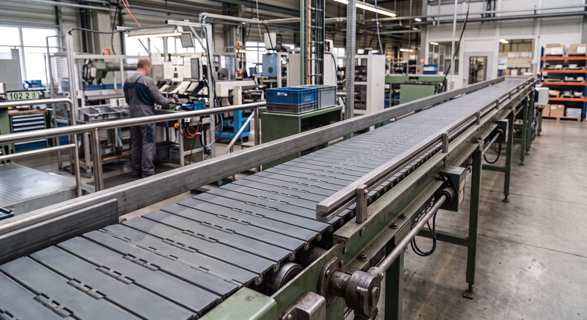
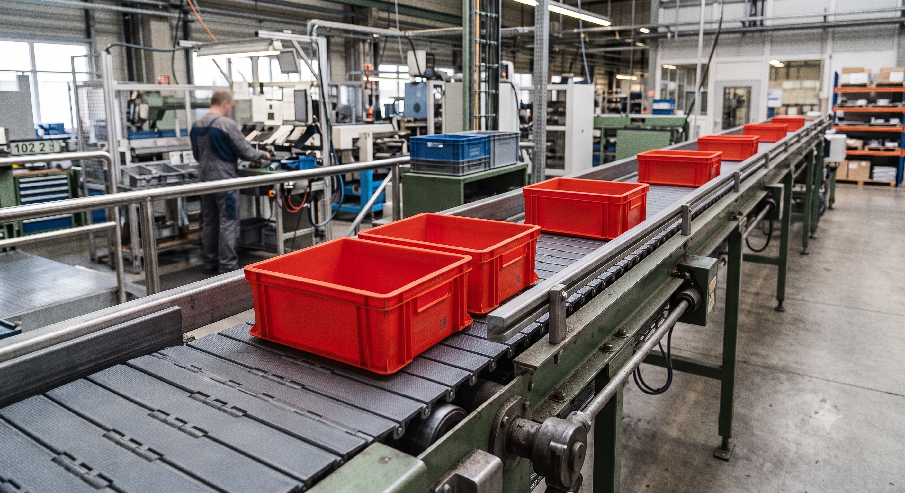

# Industrial Computer Vision

In modernen, automatisierten Fertigungshallen sind reibungslose Materialflüsse das Rückgrat der Produktion. Im Zentrum dieses Szenarios steht eine automatische Förderanlage, die Werkstücke und Kisten kontinuierlich von einer Fertigungsstation zur nächsten transportiert.

Trotz präziser Mechanik kommt es in einem spezifischen Teilbereich dieser Anlage immer wieder zu unvorhergesehenen Störungen und Prozessunterbrechungen. Um die Anlagenverfügbarkeit zu maximieren und Stillstandszeiten zu minimieren, soll eine videogestützte Echtzeit-Überwachung implementiert werden. Ziel ist es, optische Anomalien und Fehlerzustände mithilfe von Computer-Vision-Algorithmen vollautomatisch zu erkennen und zu melden.

## Systemlogik

Das zu entwickelnde KI-System muss im Kern drei Betriebszustände der Förderanlage zuverlässig voneinander unterscheiden können:

* **Blockierungen (Fehlerzustand):** Regelmäßig führen fehlerhaft platzierte oder verkantete Objekte auf dem Förderband zu Staus. Diese Situationen müssen sofort als kritischer Fehler identifiziert werden, um Folgeschäden an der Anlage zu verhindern.

* **Leerlauf (Anomalie-Indikator):** Transportiert das Förderband über einen definierten Zeitraum hinweg überhaupt keine Kisten, ist dies ein starkes Indiz für eine Störung oder Materialknappheit in den vorgelagerten Prozessschritten der Maschine.

* **Normalbetrieb (Sollzustand):** Der fehlerfreie, kontinuierliche Transport von Kisten.

## Daten

Im Verzeichnis data steht bereits ein dedizierter Bilddatensatz aus einer realen Fertigungsstraße zur Verfügung. Die Aufnahmen spiegeln die verschiedenen visuellen Szenarien und Umgebungsbedingungen (z. B. wechselnde Lichtverhältnisse, unterschiedliche Objektpositionen) wider, in denen sich das Förderband befinden kann.

Unsere Aufgabe ist es, diese Bilddaten zu nutzen, um ein Deep-Learning-Modell zu trainieren, das in der Lage ist, die visuellen Merkmale der einzelnen Zustände zu extrahieren und die Situationen präzise zu klassifizieren.

## Aufgabenstellung

* [ ] Erstelle eine Lernumgebung, um ein Deep-Learning-Modell zu entwickeln.
* [ ] Entwickle ein Netzlayout, um die Daten zu verarbeiten.
* [ ] Trainiere das Netz.
* [ ] Evaluiere die Ergebnisse deines Trainings.
