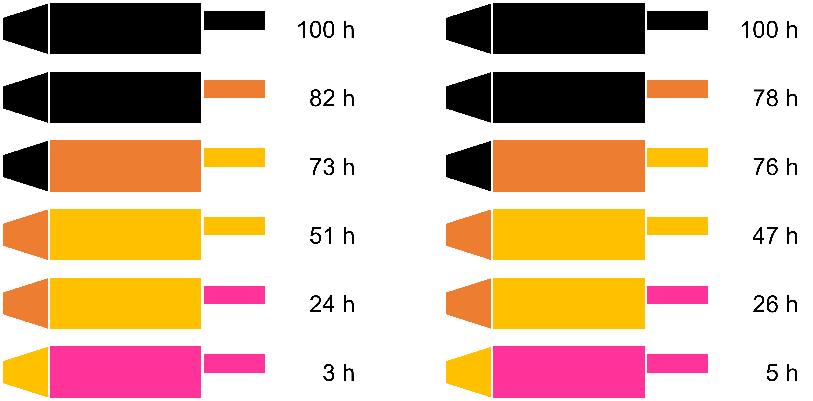

# Abschhließende Projektarbeit Deep-Learning

Die Projektarbeit dient als Grundlage für die Leistungsbewertung im zweiten Teil von Industrial Computing. In der Projektarbeit beschäftigt ihr euch mit den Themen aus den Megatutorials auf Basis eines neuen Szenarios. Legt dazu gerne ein Github-Repo an und bereitet dieses so vor, dass euer Code reproduzierbar genutzt werden kann. Fügt mich (mckoh) als Member hinzu (oder macht euer Repo public). Alternativ könnt ihr auch gerne lokal arbeiten.

* Falls ihr in **Github arbeitet**, könnt ihr gerne den Link zu eurem Repo in Sakai abgeben.
* Falls ihr **lokal arbeitet**, könnt ihr gerne eure Files als ZIP in Sakai abgeben.

** Szenario

Ihr habt euch in den vergangenen Mega-Tutorials als super Data Scientists bewiesen. Nun will euch der Alienstamm der Glys als Deep-Learning-Expert:innen engagieren. Ihr sollt dabei helfen, ein Predictive-Maintenance-System für Raumschiffantriebe zu entwickeln. Dazu stellt man euch Daten aus einer Versuchsreihe mit dem neuesten Triebwerks-Typ zur Verfügung. Ihr bekommt Bilder einer Wärmekamera und die Aufzeichnung darüber, wie viele Betriebsstunden das gezeigte Triebwerk nach dieser Aufnahme noch durchgehalten hat. Die Bilder findet ihr im ordner `triebwersbilder` im Verzeichnis dieses Dokuments.

Damit ihr euch besser orientieren könnt, bekommt ihr hier auch noch eine Tempearturskala, die euch zeigt, wie sich das Metall der Triebwerke bei unterschiedlichen Temperaturen verhält.

Eure Aufgabe ist es, ein Machine Learning Modell zu entwickeln, das in der Lage ist, die verbleibende Lebensdauer eines Triebwerks auf Basis der Temperaturverteilung im Triebwerk zu schätzen.

Ihr könnt dieses Modell entweder als Klassifikationsmodell ausarbeiten, oder auch als Regressionsmodell.

> **Hinwei Klassifikationsmodell:** Wenn ihr euer Modell als Klassifikationsmodell aufbauen wollt, könnt ihr die Temperaturwerte in Klassen überführen, z. B.: 0-10h, 11-20h, 21-30h, 31-40h usw.. In diesem Fall könnt ihr als Loss-Funktion unsere gute, alte `sparse_categorical_crossentropy` verwenden.

> **Hinweis Regressionsmodell:** Wenn ihr euer Modell als Regressionsmodell aufbauen wollt, sollte euer Modell auf der letzten Schicht nur ein Neuron haben und als Aktivierungsfunktion `linear` verwenden (`Dense(1, activation="linear")`). Als Loss-Funktion müsst ihr in diesem Fall aber `mse`, also den mittleren quadratischen Fehler (Mean Squared Error) verwenden - ihr werdet sehen, das funktioniert super.

## Aufgaben

* [ ] Führt die Feature-Extraction durch (25%)
* [ ]  Setze eine geeignete Umgebung auf um reproduzierbare ML Ergebnisse zu bekommen (10%)
* [ ]  Entwirf eine geeignete Netzarchitektur (15%) und probiere eine zweite, alternative Architektur aus (15%)

> **Idee:** Ihr müsst euer Zeites Netz nicht als CNN ausführen. Wenn ihr wollt, könnt ihr eure Input-Daten durchaus auch als nummerische Vektoren operationalisieren. Das nur als Idee 😉.

* [ ] Wähle geeignete Trainingseinstellungen aus und trainiere das Netz (15%)
* [ ]  Analysiere die Schätzgenauigkeit des Netzes (20%)
